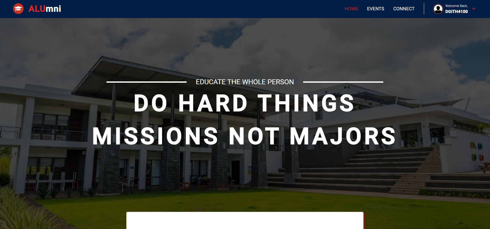

# <a href="https://github.com/githiomi/ALUmni.git" target="_blank"></a> ALUmni

> Created by <a href="https://www.github.com/githiomi"> Daniel Githiomi </a>

## 🚧 Description

`ALUmni` is a project developed using Node, Angular, Typescript, HTML5 and CSS and other third-party libraries. It is a web-based platform wherein each student's alumni can connect and, at the same time,participate in various events organized by the group.

## 👀 Product Preview



## 🏗️ Development server

Run `ng serve` for the development server. Navigate to __`http://localhost:4200/`__. The application will automatically reload if you change any of the source files.

## 🏁 App Configuration

Install dependencies

```` (nodejs)
npm install
````

Run Angular server __(http://localhost:4200)__

## ⏬ Setup/Installation Minimal Requirements

You will need to have the following installed on your system for the application to run:

* Any Modern Browser.
* `Node JS` installed on your machine

Make sure to run the following command to get the `node_modules` folder added to your version.

```(nodejs)
npm init
```

## ➕ Compatibility

Compatible with all mordern browsers.

## 🤖 Technologies & Resources Used

It is made entirely using Visual Studio Code in ollaboration with the Angular CLI to create all the files and to achieve the output as you see it.

* `Typescript` - Angular core language.
* `Angular` - Client-Side Frontend Framework.
* `Angular Material` - Angular Material library to help with component creation.
* `TailwindCSS` - Styling Framework

```(nodejs)
ng add @angular/material
```

## 🪲 Known Bugs

The system works efficiently and is 100% guaranteed.

## 🏗️ Setup Instructions

In order to enjoy the features of this application you will need to:

* Git clone [this](https://github.com/githiomi/ALUmni) into your terminal to your
  desired directory.
* Open the project in an IDE of choice (Eg: Visual Studio Code).
* Run 'ng serve' to run the application on the development server.
* Enjoy the `ALUmni` Angular Application and Shop at will.

## 🦾 Live Page

* The application has been hosted using `GitHub Pages` and the link to the live page can be found [here](https://githiomi.github.io/ALUmni).

## 📧 Support and contact details

Contact me through any of the following:

* Slack: danielgithiomi
* Email: danielgithiomi@gmail.com
* Github: githiomi

## 📃 License

Click the following to access the license
page: [Click-Here](https://githiomi.github.io/Privacy-Policy/)

> Copyright (c) {2023} DhosioLux Co.
